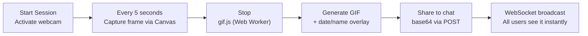
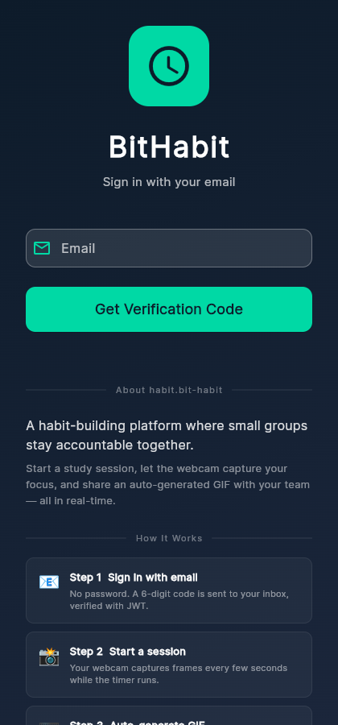
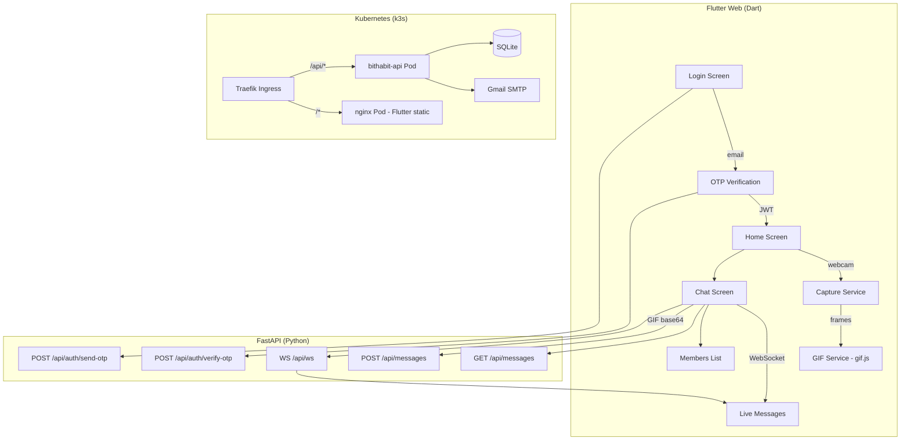
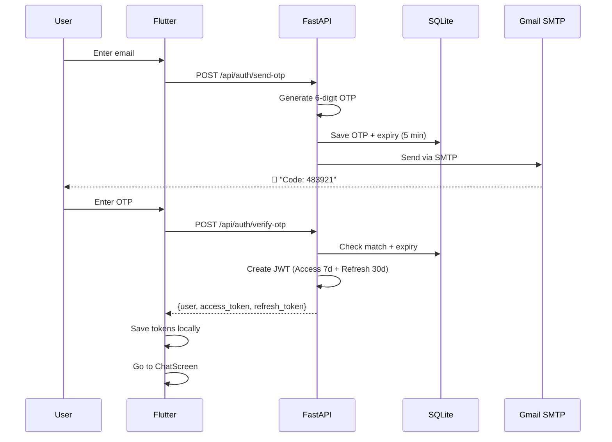
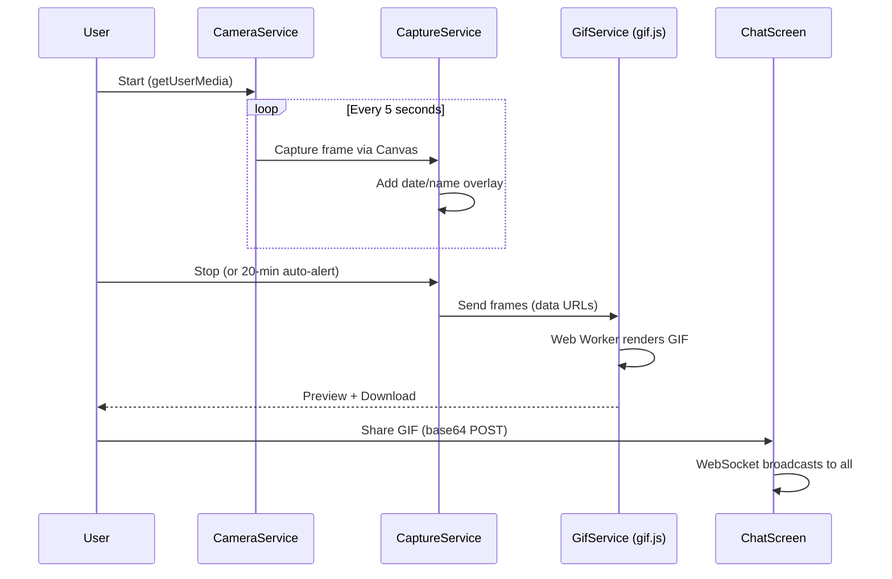

# 🕐 BitHabit

> **A habit-tracking app for small study groups.**  
> Record study sessions via webcam, auto-generate GIFs, and share progress in real-time chat.

🌐 **Live**: [habit.bit-habit.com](https://habit.bit-habit.com)  
📦 **Repo**: [github.com/bookseal/bithabit](https://github.com/bookseal/bithabit)  
🏆 **2nd Place — IITP Hackathon** · Users still active after 2 years

---

## Why This Exists

Habit apps like Challengers focus on growing user numbers, but sacrifice **proof quality**. In a "walk the stairs" challenge, just taking a photo of stairs counts as proof. That's too easy to fake.

What people actually need is proof that they **focused for 20+ minutes** — and a way to share it that's lightweight and trustworthy.

### BitHabit vs Challengers

| | Challengers | BitHabit |
|---|---|---|
| Proof method | Single photo | **Time-lapse video (random interval captures)** |
| Fake risk | High (reuse old photos) | **Low (date/name overlay + random timing)** |
| File size | N/A | **Much smaller than video (GIF)** |
| Group size | Large (less accountability) | **Small (3-5 people, real accountability)** |
| Still used after 2 years? | — | **Yes** |

---

## Core Flow



---

## Screenshots

### Login — Passwordless Email OTP


Enter email → get a 6-digit code → sign in. No password needed.

### Login Page — Built-in About Section


The login page doubles as a portfolio — feature cards, tech stack, and data flow are shown before signup.

### Chat Room — Real-time Messaging
- **"Start Session" button** — opens the webcam timer
- **WebSocket real-time** — messages appear instantly for everyone
- **Members drawer** — tap 👥 to see all members

### Study Timer — Webcam + GIF
Webcam activates, timer runs, frames are captured every 5 seconds. On stop, a GIF is generated and can be shared to the chat room.

---

## Architecture



---

## Auth — Email OTP + JWT

No passwords. Users verify their email with a one-time code, then get JWT tokens.



### Why these token lifetimes?

| Decision | Value | Why |
|---|---|---|
| Access token | 7 days | Users visit ~5x/week — rarely need to re-auth |
| Refresh token | 30 days | Skip a week and still stay logged in |
| Algorithm | HS256 | Simple, enough for single-server setup |
| Server-side storage | None (stateless) | Pure signature check, no DB query needed |

---

## GIF Pipeline — $0 Server Cost



**Key design choices:**
- **Client-side GIF** — gif.js runs in a Web Worker. Server does zero work
- **Date/name overlay** — Canvas `drawText()` prevents reusing others' recordings
- **20-minute alert** — beep + blink animation when time is up
- **Random capture timing** — harder to game with pre-recorded content

---

## Tech Stack

| Layer | Technology | Why |
|-------|-----------|-----|
| Frontend | **Flutter Web** (Dart) | One codebase for web and mobile |
| Backend | **FastAPI** (Python) | Async REST + WebSocket |
| Database | **SQLite** + SQLAlchemy | Lightweight, fits single server |
| Auth | **Email OTP + JWT** | No passwords, stateless |
| Real-time | **WebSocket** broadcast | Live chat |
| GIF Engine | **gif.js** (Web Worker) | Runs on client, $0 server cost |
| Infra | **k3s** + Traefik + HTTPS | Production Kubernetes |

---

## Deployment

```
habit.bit-habit.com
    │
    ├── Traefik Ingress (TLS)
    │     ├── /api/*  →  bithabit-api Pod (FastAPI :8000)
    │     └── /*      →  static-web Pod (nginx, Flutter build)
    │
    ├── bithabit-api
    │     ├── Env: GMAIL_ADDRESS, GMAIL_APP_PASSWORD, JWT_SECRET
    │     └── Volume: /data/bithabit.db + /data/uploads/
    │
    └── static-web
          └── Volume: Flutter build/web/
```

---

## Project Structure

```
bithabit_flutter/               # Frontend
├── lib/
│   ├── main.dart               # Entry + auto-login logic
│   ├── screens/
│   │   ├── login_screen.dart   # Email → OTP → Register
│   │   ├── home_screen.dart    # Camera + Timer + GIF
│   │   └── chat_screen.dart    # Real-time chat + Members
│   ├── services/
│   │   ├── api_service.dart    # REST client + JWT
│   │   ├── camera_service.dart # getUserMedia wrapper
│   │   ├── capture_service.dart# Frame capture
│   │   └── gif_service.dart    # gif.js interop
│   └── widgets/

bithabit_api/                   # Backend
├── main.py                     # FastAPI + JWT + WebSocket
├── models.py                   # SQLAlchemy models
├── database.py                 # SQLite connection
├── requirements.txt
└── Dockerfile
```

---

## Run Locally

```bash
# Backend
cd bithabit_api
pip install -r requirements.txt
uvicorn main:app --host 0.0.0.0 --port 8080

# Frontend (dev)
cd bithabit_flutter
flutter pub get && flutter run -d chrome

# Frontend (production)
flutter build web
```

---

Built with Flutter + FastAPI. Deployed via k3s on Oracle OCI.
