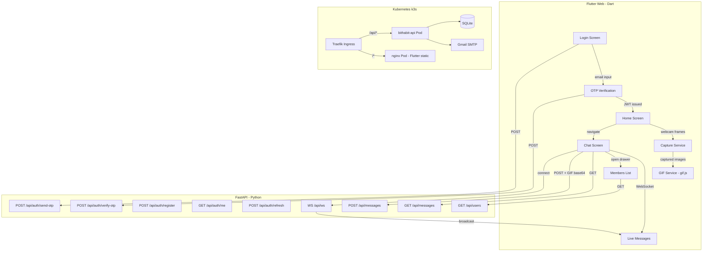
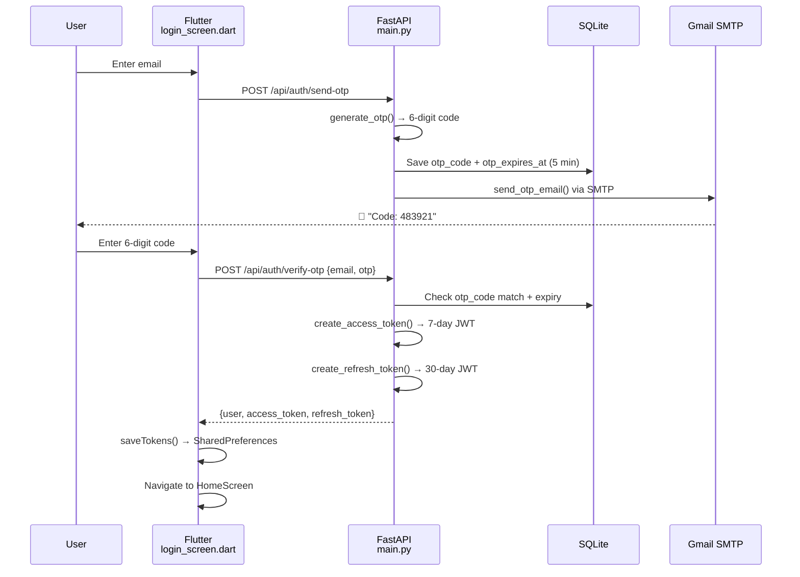
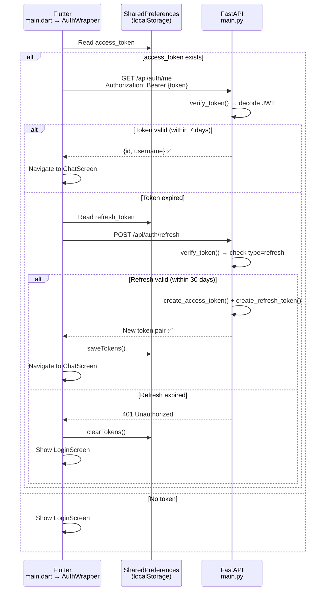
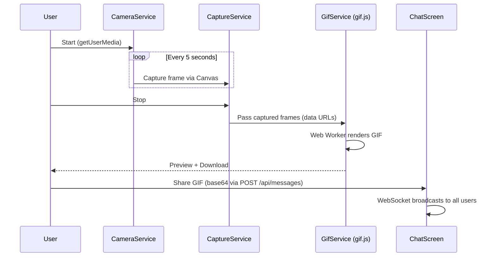

# 🕐 BitHabit

> **A habit-tracking web app for small study groups.**  
> Record study sessions via webcam, auto-generate GIFs, and share progress in real-time chat.

🌐 **Live**: [habit.bit-habit.com](https://habit.bit-habit.com) · 5 active daily users  
📦 **Repo**: [github.com/bookseal/bithabit](https://github.com/bookseal/bithabit)

---

## Screenshots

### Login — Passwordless Email OTP


Enter your email → receive a 6-digit code → sign in. No password needed.  
New users are auto-directed to a registration step where the email prefix becomes the default nickname.

### Login Page — Built-in About Section


Below the login form, the app renders an interactive **About BitHabit** section directly in the UI:

- **Feature grid** — 6 cards: Study Timer, GIF Export, Live Chat, 20-min Alert, Attendance, Email Auth
- **Tech stack chips** — Flutter Web, Dart, FastAPI, Python, SQLite, WebSocket, Gmail SMTP, gif.js
- **Data flow summary** — Login → Start → Stop → Share, each step explained in one line

This serves as both a portfolio showcase and user onboarding — visitors see what the app does before signing up.

### Chat Room — Real-time Messaging
<!-- To add: capture from a real browser with camera permission -->
The chat screen features:
- **"Start Session" button** — navigates to the webcam timer screen
- **Message list** — text and GIF messages with sender avatars, timestamps
- **WebSocket real-time** — new messages appear instantly for all connected users
- **Members drawer** — tap the 👥 icon to see all registered members with `you` badge

### Study Timer — Webcam + GIF Pipeline
The home screen activates the webcam, runs a study timer, captures frames every 5 seconds, and generates an animated GIF on stop. The GIF can be downloaded or shared directly to the chat room.

---

## Tech Stack

| Layer | Technology |
|-------|-----------|
| Frontend | **Flutter Web** (Dart) — single codebase for web/mobile |
| Backend | **FastAPI** (Python) — async REST API + WebSocket |
| Database | **SQLite** via SQLAlchemy ORM |
| Auth | **Email OTP + JWT** — passwordless, stateless token auth |
| Real-time | **WebSocket** broadcast for live chat |
| GIF Engine | **gif.js** (client-side, Web Worker-based) |
| Infra | **Kubernetes (k3s)** + Traefik Ingress + HTTPS |

---

## Architecture



---

## Auth — Email OTP + JWT Token System

Zero passwords. Users prove identity via email OTP, then receive JWT tokens for persistent sessions.

### Login Flow (OTP → JWT issuance)



### Auto-Login Flow (token-based, no re-authentication)

Users stay logged in for up to 30 days without re-entering email/OTP.



### JWT Implementation Details

| Component | File | Function | Description |
|-----------|------|----------|-------------|
| Token creation | `main.py` | `create_access_token()` | HS256-signed JWT, 7-day expiry, payload: `{sub, username, type}` |
| Token creation | `main.py` | `create_refresh_token()` | HS256-signed JWT, 30-day expiry, payload: `{sub, type}` |
| Token verification | `main.py` | `verify_token()` | Decodes + validates signature and expiry via `python-jose` |
| Route protection | `main.py` | `get_current_user()` | FastAPI `Depends()` — extracts Bearer token → returns `User` |
| Token storage | `api_service.dart` | `saveTokens()` | Saves both tokens to `SharedPreferences` (browser localStorage) |
| Auto-login | `api_service.dart` | `tryAutoLogin()` | Tries access → falls back to refresh → clears on failure |
| Logout | `api_service.dart` | `clearTokens()` | Removes all tokens + user data from localStorage |
| Auth header | `api_service.dart` | `_authHeaders()` | Injects `Authorization: Bearer` into every API request |
| Members list | `api_service.dart` | `getUsers()` | Fetches all registered users for the members drawer |

**Design choices:**
- **7-day access token** — users access ~5x/week, so 7 days means they rarely need to re-authenticate
- **30-day refresh token** — even if they skip a week, they stay logged in
- **HS256 signing** — symmetric key, simple for single-server deployment
- **Stateless** — server never stores tokens; validation is pure signature check (no DB query)
- **Graceful degradation** — message API accepts requests with or without JWT for backward compatibility

---

## Study Session → GIF Pipeline



**Technical highlights:**
- **Client-side GIF generation** — no server compute needed; gif.js runs in a Web Worker
- **Canvas-based frame capture** — `drawImage()` from `<video>` element every 5s
- **20-minute alert** — AudioContext oscillator beep + CSS blink animation
- **Camera switch** — `facingMode` toggle between `user` and `environment`

---

## Project Structure

```
bithabit_flutter/               # Frontend
├── lib/
│   ├── main.dart               # App entry, AuthWrapper (auto-login logic)
│   ├── screens/
│   │   ├── login_screen.dart   # Email → OTP → Register (3-step flow)
│   │   ├── home_screen.dart    # Camera + Timer + GIF generation
│   │   └── chat_screen.dart    # Real-time chat + Members drawer
│   ├── services/
│   │   ├── api_service.dart    # REST API client + JWT token management
│   │   ├── camera_service.dart # getUserMedia wrapper
│   │   ├── capture_service.dart# Periodic frame capture (Canvas)
│   │   └── gif_service.dart    # gif.js JS interop
│   └── widgets/                # Reusable UI components
│
bithabit_api/                   # Backend
├── main.py                     # FastAPI app, endpoints + JWT auth + WebSocket
├── models.py                   # SQLAlchemy models (User, Message)
├── database.py                 # SQLite connection
├── requirements.txt            # python-jose, fastapi, sqlalchemy, etc.
└── Dockerfile                  # Production container image
```

---

## Deployment

```
habit.bit-habit.com
    │
    ├── Traefik Ingress (TLS termination)
    │     ├── /api/*  →  bithabit-api Pod (FastAPI, port 8000)
    │     └── /*      →  static-web Pod (nginx, Flutter build/web)
    │
    ├── bithabit-api Deployment
    │     ├── Docker image: bithabit-api:latest
    │     ├── Env: GMAIL_ADDRESS, GMAIL_APP_PASSWORD, JWT_SECRET
    │     └── Volume: hostPath → /data/bithabit.db + /data/uploads/
    │
    └── static-web Deployment
          └── Volume: hostPath → bithabit_flutter/build/web/
```

`flutter build web` → files are live instantly (nginx serves from hostPath mount).

---

## Local Development

```bash
# Backend
cd bithabit_api
pip install -r requirements.txt
uvicorn main:app --host 0.0.0.0 --port 8080

# Frontend (dev mode)
cd bithabit_flutter
flutter pub get && flutter run -d chrome

# Frontend (production build)
flutter build web  # → build/web/
```
